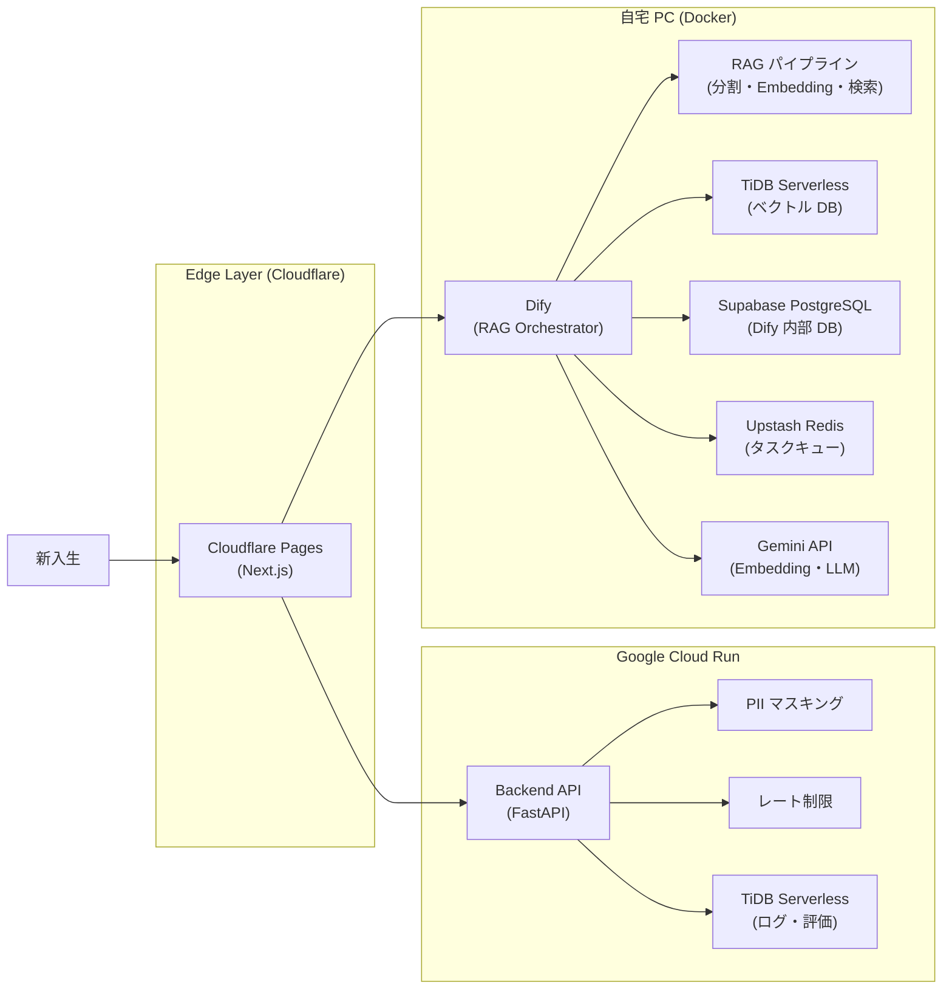

# Jyogi Navi

じょぎ（ランニングサークル）の新入生向け AI チャットボット。Discord ログや Notion ナレッジをもとに RAG で回答し、新入生の不安解消と部員の対応負担軽減を目的とするサービスです。

---

## 概要

| 項目 | 内容 |
| --- | --- |
| 対象ユーザー | サークル新入生（匿名） / 部員（管理者） |
| コア体験 | 気軽に・何度でも・遠慮なくじょぎについて質問できるチャット |
| 成功指標 | 新入生対応数 1.5 倍 / 対応時間 30% 削減 / 入部率 10% 向上 |
| 予算 | 月額 0 円（完全無料枠運用） |

---

## 権限/管理ポリシー

- **P0 は公開アクセス**：新入生向けチャットは認証不要（匿名セッション）
- **管理画面は Discord OAuth 必須（P1）**：じょぎ Discord サーバの部員ロールを所持するアカウントのみアクセス可能
- **RBAC で ADMIN / MEMBER を分離**：設定変更・取り込み実行は ADMIN のみ、ログ/評価閲覧は MEMBER 以上に許可
- **認可の最終判定はサーバーサイド**：フロントの表示制御は UX 補助のみ（詳細: [docs/04_permission-design.md](docs/04_permission-design.md)）

---

## システム構成



---

## 技術スタック

### フロントエンド

| 項目 | 技術 |
| --- | --- |
| 言語 | TypeScript |
| フレームワーク | Next.js (App Router / OpenNext) |
| UI | shadcn/ui + Tailwind CSS |
| 状態管理 | TanStack Query |
| フォーム | React Hook Form + Zod |
| テスト | Vitest |
| ホスティング | Cloudflare Pages |

### バックエンド API

| 項目 | 技術 |
| --- | --- |
| 言語 | Python |
| フレームワーク | FastAPI |
| バリデーション | Pydantic |
| ホスティング | Google Cloud Run |

### RAG

| 項目 | 技術 |
| --- | --- |
| オーケストレーション | Dify（セルフホスト / Docker） |
| ベクトル DB | TiDB Serverless |
| Embedding / LLM | Gemini |
| 公開 | Cloudflare Tunnel |

### インフラ / DevOps

| 項目 | 技術 |
| --- | --- |
| DB（Dify 内部） | Supabase PostgreSQL |
| キャッシュ | Upstash Redis |
| CI/CD（FE・API） | GitHub Actions (cloud-hosted) |
| CI/CD（Dify） | GitHub Actions (self-hosted runner) |
| 監視 | Sentry |
| ログ管理 | Cloud Logging |

---

## リポジトリ構成

```
root/
├── .github/workflows/       # GitHub Actions（FE / API / Dify デプロイ）
├── apps/
│   ├── web/                 # 新入生向けチャット UI（Next.js）
│   ├── api/                 # バックエンド API（FastAPI）
│   └── admin/               # 管理画面（Next.js） ※P1
├── scripts/
│   ├── ingest/              # Discord / Notion データ取り込みスクリプト
│   └── ops/                 # KPI 集計・バックアップ
├── infra/
│   ├── dify/                # Dify docker-compose 設定
│   ├── docker/              # API 用 Dockerfile
│   └── env/                 # 環境変数テンプレート
└── docs/                    # 設計ドキュメント
```

---

## セットアップ

### 必要環境

- Node.js 20+
- Python 3.12+
- Docker / Docker Compose
- [uv](https://github.com/astral-sh/uv)（Python パッケージ管理）

### フロントエンド（apps/web）

```bash
cd apps/web
npm install
cp .env.example .env.local
npm run dev
```

### バックエンド API（apps/api）

```bash
cd apps/api
cp .env.example .env
uv sync
uv run uvicorn main:app --reload
```

### Dify（infra/dify）

```bash
cd infra/dify
cp .env.example .env
# .env に各種キーを設定（TiDB / Supabase / Gemini 等）
docker compose up -d
```

> Cloudflare Tunnel を使って外部公開する場合は `cloudflared` を別途設定してください。

---

## 環境変数

各アプリの `.env.example` を参照してください。

| パス | 対象 |
| --- | --- |
| `apps/api/.env.example` | FastAPI |
| `infra/dify/.env.example` | Dify（TiDB / Supabase / Gemini キー等） |
| `infra/env/.env.example` | 共通 |

---

## デプロイ

`main` ブランチへの push で以下が自動実行されます。

| ワークフロー | ランナー | デプロイ先 |
| --- | --- | --- |
| `deploy-fe.yml` | cloud-hosted | Cloudflare Pages |
| `deploy-api.yml` | cloud-hosted | Google Cloud Run |
| `deploy-dify.yml` | self-hosted（自宅 PC） | Docker Compose 再起動 |

---

## ドキュメント

| ファイル | 内容 |
| --- | --- |
| [docs/01_feature-list.md](docs/01_feature-list.md) | 機能一覧・優先度 |
| [docs/02_tech-stack.md](docs/02_tech-stack.md) | 技術スタック詳細 |
| [docs/03_screen-flow.md](docs/03_screen-flow.md) | 画面フロー・アーキテクチャ図 |
| [docs/04_permission-design.md](docs/04_permission-design.md) | 権限設計 |
| [docs/05_erd.md](docs/05_erd.md) | ER 図 |
| [docs/06_directory.md](docs/06_directory.md) | ディレクトリ構成 |
| [docs/07_infrastructure.md](docs/07_infrastructure.md) | インフラ構成 |
| [docs/08_logging.md](docs/08_logging.md) | ログ設計 |
| [docs/09_schedule_and_issues.md](docs/09_schedule_and_issues.md) | スケジュールと課題 |
