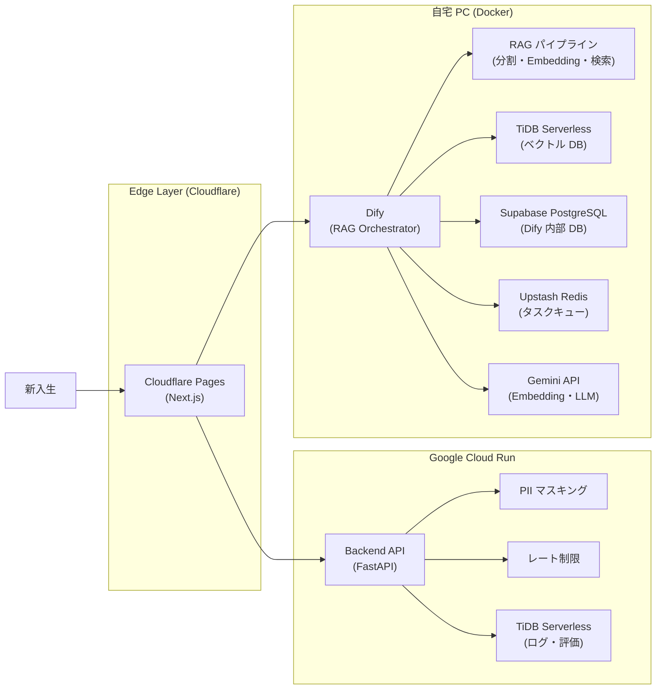

# Jyogi Navi

じょぎ（ランニングサークル）の新入生向け AI チャットボット。Discord ログや Notion ナレッジをもとに RAG で回答し、新入生の不安解消と部員の対応負担軽減を目的とするサービスです。

---

## 概要

| 項目 | 内容 |
| --- | --- |
| 対象ユーザー | サークル新入生（匿名） / 部員（管理者） |
| コア体験 | 気軽に・何度でも・遠慮なくじょぎについて質問できるチャット |
| 成功指標 | 新入生対応数 1.5 倍 / 対応時間 30% 削減 / 入部率 10% 向上 |
| 予算 | 月額 0 円（完全無料枠運用） |

---

## 権限/管理ポリシー

- **P0 は公開アクセス**：新入生向けチャットは認証不要（匿名セッション）
- **管理画面は Discord OAuth 必須（P1）**：じょぎ Discord サーバの部員ロールを所持するアカウントのみアクセス可能
- **RBAC で ADMIN / MEMBER を分離**：設定変更・取り込み実行は ADMIN のみ、ログ/評価閲覧は MEMBER 以上に許可
- **認可の最終判定はサーバーサイド**：フロントの表示制御は UX 補助のみ（詳細: [docs/04_permission-design.md](docs/04_permission-design.md)）

---

## システム構成



---

## 技術スタック

### フロントエンド

| 項目 | 技術 | 採用理由 | 評価観点 |
| --- | --- | --- | --- |
| 言語 | TypeScript | Discord API など複雑なレスポンスを型安全に扱える | 型安全性・保守性 |
| フレームワーク | Next.js (App Router / OpenNext) | SSR/ISR による高速化と API Routes による軽量バックエンド処理の完結 | パフォーマンス・エコシステム |
| UI | shadcn/ui + Tailwind CSS | コピー&ペーストで導入可能・カスタマイズ性が高くライブラリ肥大化を防げる | 開発速度・デザイン一貫性 |
| 状態管理 | TanStack Query | RAG API からのデータ取得・キャッシュ・ローディング状態管理に最適 | スケール耐性・Server State 分離 |
| フォーム | React Hook Form + Zod | Zod によるスキーマ定義で入力バリデーションを型安全に実装 | パフォーマンス・バリデーション |
| テスト | Vitest | Jest より高速で Next.js との親和性が高い | カバレッジ・実行速度 |
| ホスティング | Cloudflare Pages | CDN・Edge SSR・DDoS 防御が無料枠で利用可能 | コスト・パフォーマンス |

### バックエンド API

| 項目 | 技術 | 採用理由 | 評価観点 |
| --- | --- | --- | --- |
| 言語 | Python | RAG エコシステム・Dify との整合性。Pydantic で型安全性を確保 | 生産性・保守性 |
| フレームワーク | FastAPI | 高速・自動ドキュメント生成。単一コンテナで動作し Cloud Run と相性が良い | 構造化・拡張性 |
| バリデーション | Pydantic | スキーマ定義による入力検証と型安全な設定管理 | 型安全性・保守性 |
| 非同期処理 | Cloud Tasks | 取り込みジョブ等の非同期実行。再試行・耐障害性を確保 | 再試行・耐障害性 |
| ホスティング | Google Cloud Run | Scale to Zero 対応。月 200 万リクエストまで無料 | コスト・可用性 |

> **無料枠前提**：Cloud Run は月 200 万リクエスト・180,000 vCPU 秒まで無料。通常期（MAU ～50）は無料枠内で収まる。勧誘期（4 月）は最小インスタンス数を一時的に 1 に設定してコールドスタートを防止する。

### RAG

| 項目 | 技術 | 採用理由 | 評価観点 |
| --- | --- | --- | --- |
| オーケストレーション | Dify（セルフホスト / Docker） | RAG パイプライン（分割・Embedding・検索）を GUI で完結でき、Chat API 公開も容易 | 開発効率・運用性 |
| ベクトル DB | TiDB Serverless | 12 GB まで無料。ベクトル検索と全文検索のハイブリッドに対応 | 検索精度・コスト |
| Embedding / LLM | Gemini | 日本語セマンティック検索で高精度。無料枠・少額課金で対応可能 | 検索精度・コスト |
| 公開 | Cloudflare Tunnel | ポート開放・固定 IP 不要で自宅 PC を HTTPS 公開 | セキュリティ・可用性 |

> **無料枠前提**：TiDB Serverless は 12 GB まで無料。Gemini は無料枠および少額課金で運用。Dify は自宅 PC で動作させるためホスティングコスト 0 円。

### インフラ / DevOps

| 項目 | 技術 | 採用理由 | 評価観点 |
| --- | --- | --- | --- |
| DB（Dify 内部） | Supabase PostgreSQL | Dify 推奨の内部 DB。MySQL 系でエラー事例あり。500 MB まで無料 | 安定性・コスト |
| キャッシュ | Upstash Redis | Dify のタスクキュー・レート制限カウンタ用。1 日 1 万リクエストまで無料 | レイテンシ・コスト |
| CI/CD（FE・API） | GitHub Actions (cloud-hosted) | Cloudflare Pages・Cloud Run への自動デプロイ | 自動化・安定性 |
| CI/CD（Dify） | GitHub Actions (self-hosted runner) | 自宅 PC 上で docker-compose pull & up を自動実行 | 自動化 |
| 監視 | Sentry | エラー検知・アラート | 可観測性 |
| ログ管理 | Cloud Logging | Cloud Run（FastAPI）のログを Google Cloud 標準機能で管理 | トレーサビリティ |

---

## リポジトリ構成

```
root/
├── .github/workflows/       # GitHub Actions（FE / API / Dify デプロイ）
├── apps/
│   ├── web/                 # 新入生向けチャット UI（Next.js）
│   ├── api/                 # バックエンド API（FastAPI）
│   └── admin/               # 管理画面（Next.js） ※P1
├── scripts/
│   ├── ingest/              # Discord / Notion データ取り込みスクリプト
│   └── ops/                 # KPI 集計・バックアップ
├── infra/
│   ├── dify/                # Dify docker-compose 設定
│   ├── docker/              # API 用 Dockerfile
│   └── env/                 # 環境変数テンプレート
└── docs/                    # 設計ドキュメント
```

---

## セットアップ

### Nix による自動セットアップ（推奨）

Nix と direnv を使用すると、プロジェクトディレクトリに `cd` するだけで開発環境が自動的にセットアップされます。

```bash
# 1. Nix をインストール（未インストールの場合）
curl --proto '=https' --tlsv1.2 -sSf -L https://install.determinate.systems/nix | sh -s -- install

# 2. direnv をインストール（未インストールの場合）
brew install direnv  # macOS
# または: sudo apt install direnv  # Linux

# 3. シェル設定に direnv フックを追加（~/.zshrc または ~/.bashrc）
eval "$(direnv hook zsh)"  # zsh の場合
# または: eval "$(direnv hook bash)"  # bash の場合

# 4. プロジェクトディレクトリで direnv を許可
cd /path/to/Jyogi_navi
direnv allow
```

これで Node.js、pnpm、Python、uv などが自動的に利用可能になります。

詳細なセットアップ手順は [docs/nix-setup.md](docs/nix-setup.md) を参照してください。

### 手動セットアップ

Nix を使用しない場合は、以下を手動でインストールしてください。

#### 必要環境

- Node.js 20+
- Python 3.13+
- Docker / Docker Compose
- [uv](https://github.com/astral-sh/uv)（Python パッケージ管理）

### フロントエンド（apps/web）

```bash
cd apps/web
npm install
cp .env.example .env.local
npm run dev
```

### バックエンド API（apps/api）

```bash
cd apps/api
cp .env.example .env
uv sync
uv run uvicorn main:app --reload
```

### Dify（infra/dify）

```bash
cd infra/dify
cp .env.example .env
# .env に各種キーを設定（TiDB / Supabase / Gemini 等）
docker compose up -d
```

> Cloudflare Tunnel を使って外部公開する場合は `cloudflared` を別途設定してください。

### TiDB Serverless タイムゾーン設定（初回必須）

> **警告**：TiDB Serverless のデフォルトタイムゾーンは `SYSTEM`（地域依存）です。設定が UTC でない場合、`usage_logs` の日次集計やレート制御の日次境界がずれます（[docs/07_infrastructure.md](docs/07_infrastructure.md) 参照）。

クラスター作成後・初回デプロイ前に、十分な権限を持つユーザーで以下を **必ず** 実行してください。

```sql
SET GLOBAL time_zone = 'UTC';
```

- TiDB Serverless コンソール（SQL Editor）またはクライアントツールから実行します
- `SET GLOBAL` は管理者権限が必要です。一般ユーザーでは反映されません
- 設定はクラスター再起動後も永続されます（TiDB Serverless の仕様に従い保持）

---

## 環境変数

各アプリの `.env.example` を参照してください。

| パス | 対象 |
| --- | --- |
| `apps/api/.env.example` | FastAPI |
| `infra/dify/.env.example` | Dify（TiDB / Supabase / Gemini キー等） |
| `infra/env/.env.example` | 共通 |

### TiDB 接続設定（apps/api）

[apps/api/db/session.py](apps/api/db/session.py) は以下の 5 変数から接続 URL を構築します。**すべて必須**です。

| 変数 | 説明 | デフォルト |
| --- | --- | --- |
| `TIDB_HOST` | クラスターのホスト名 | （必須） |
| `TIDB_PORT` | ポート番号 | `4000` |
| `TIDB_USER` | 接続ユーザー | （必須） |
| `TIDB_PASSWORD` | パスワード | （必須） |
| `TIDB_DATABASE` | データベース名 | （必須） |

**TLS/SSL を使用する場合（`TIDB_SSL_CA`）**

`TIDB_SSL_CA` には CA 証明書の**ファイルパス**を指定します。コードは `ssl.create_default_context(cafile=<path>)` でそのパスを直接読み込みます。

```dotenv
# 例：TiDB Serverless の CA ファイルをダウンロードしてパスを指定
TIDB_SSL_CA=/path/to/tidb-ca.pem
```

- ファイルパスに空白が含まれる場合はクォートは不要ですが、パスは絶対パスを推奨します
- Docker コンテナで実行する場合はコンテナ内のパスを指定し、ファイルをマウントしてください
- TiDB Serverless の CA 証明書は TiDB Cloud コンソールからダウンロードできます

**Alembic マイグレーション**

`apps/api/alembic.ini` の `sqlalchemy.url` はアプリの接続設定とは独立しており、`alembic` コマンド実行時のみ参照されます。マイグレーションを実行する際は `alembic.ini` の `sqlalchemy.url` も TiDB 接続文字列に更新してください。

---

## デプロイ

`main` ブランチへの push で以下が自動実行されます。

| ワークフロー | ランナー | デプロイ先 |
| --- | --- | --- |
| `deploy-fe.yml` | cloud-hosted | Cloudflare Pages |
| `deploy-api.yml` | cloud-hosted | Google Cloud Run |
| `deploy-dify.yml` | self-hosted（自宅 PC） | Docker Compose 再起動 |

---

## ドキュメント

| ファイル | 内容 |
| --- | --- |
| [docs/01_feature-list.md](docs/01_feature-list.md) | 機能一覧・優先度 |
| [docs/02_tech-stack.md](docs/02_tech-stack.md) | 技術スタック詳細 |
| [docs/03_screen-flow.md](docs/03_screen-flow.md) | 画面フロー・アーキテクチャ図 |
| [docs/04_permission-design.md](docs/04_permission-design.md) | 権限設計 |
| [docs/05_erd.md](docs/05_erd.md) | ER 図 |
| [docs/06_directory.md](docs/06_directory.md) | ディレクトリ構成 |
| [docs/07_infrastructure.md](docs/07_infrastructure.md) | インフラ構成 |
| [docs/08_logging.md](docs/08_logging.md) | ログ設計 |
| [docs/09_schedule_and_issues.md](docs/09_schedule_and_issues.md) | スケジュールと課題 |
| [docs/10_nix-setup.md](docs/10_nix-setup.md) | Nix 開発環境セットアップ |

---

## コントリビュートガイド

### ブランチ命名規則

- `<GitHubユーザー名>/<type>/<issue番号>-<概要>` の形式を推奨
  - 例：`alice/feat/60-create-readme`、`kou/fix/92-rate-limit-bug`
- `type` は `feat` / `fix` / `hotfix` / `chore` / `docs` / `refactor` のいずれか
- Issue 番号は必ず含める

### PR ルール

- タイトル：`<type>(<scope>): <概要>` の形式（例：`feat(chat): メッセージ送信を react-query で管理`）
- 本文は [.github/pull_request_template.md](.github/pull_request_template.md) のチェックリストをすべて記入してから提出
- `closes #<issue番号>` を「関連 Issue」欄に必ず記載
- マージ前に CI（lint / typecheck / test / build）がすべてグリーンであること
- マージ方式は **Squash merge** を使用し、コミット履歴を整理する

### レビュー・承認フロー

- レビュアーは [CODEOWNERS](.github/CODEOWNERS) に基づき PR 作成時に自動アサインされる
  - `apps/web/`, `apps/admin/` → @AliceWonerfulWorld
  - `apps/api/` → @KOU050223 / @NazonoKansatugata
  - `infra/`, `.github/workflows/` → @KOU050223
  - `docs/` → @NazonoKansatugata
- **最低 1 名**の承認を得てからマージする。
- レビュアーへのメモ欄に、特に見てほしい点・背景情報を記載する。
