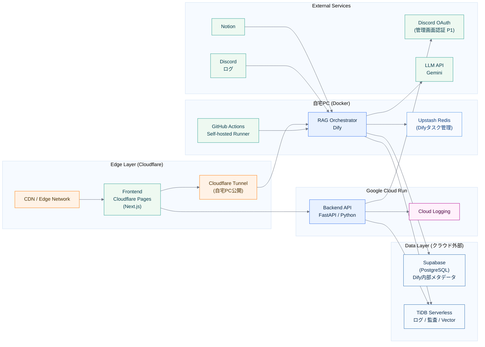

# 07_infrastructure

作成日時: 2026年3月1日 17:21
最終更新日時: 2026年3月1日 17:23
最終更新者: iseebi

# 07_infrastructure.md

# 🏗 Infrastructure Guidelines（本プロジェクト適用版）

---

# 0️⃣ 前提（本プロジェクト）

| 項目 | 内容 |
| --- | --- |
| Frontend | Next.js（Cloudflare） |
| Edge | Cloudflare CDN / WAF / Workers（必要に応じて） |
| Backend | Cloud Run（api-gateway / dify を分離、min instances=0） |
| LLM | Gemini API |
| RDB（台帳） | TiDB（Usage Ledger / Audit / Security / KPI） |
| Dify内部DB | Supabase Postgres（Cloud SQLは使わない） |
| ログ方針 | 本文は保存しない（メタ情報のみ） |
| レート制限 | トークン/日（ユーザー単位＋サークル単位） |
| デプロイ | Docker（本番も利用） + CI/CD |
| 目的 | 低コスト運用、後継運用しやすさ、スケール容易性、セキュアな境界 |

---

# System Architecture



---

# System Components

---

## 1️⃣ Edge Layer（Cloudflare）

### CDN / Edge Network

- 静的アセット配信
- TLS終端
- キャッシュ
- DDoS基本防御（Cloudflare標準）

### Cloudflare Pages（Next.js）

役割：
- 新入生向けチャットUI（P0）
- 管理画面UI（P1）
- OpenNextでCloudflare対応

### Cloudflare Tunnel

役割：
- 自宅PC上のDifyをHTTPSで外部公開
- ポート開放・固定IP不要
- `cloudflared` を自宅PCに常駐させて使用

---

## 2️⃣ Google Cloud Run

### Backend API（FastAPI / Python）

責務：
- PII（個人情報）マスキング
- レート制限チェック
- usage_logs / feedbacks 保存（TiDB）
- Discord OAuth連携（P1）

デプロイ：GitHub Actions (cloud-hosted) → Cloud Run へ自動デプロイ

---

## 3️⃣ 自宅PC（Docker）

### RAG Orchestrator（Dify）

責務：
- RAGパイプライン管理（分割・Embedding・検索）
- LLM呼び出し（Gemini）
- Chat APIとして公開（Cloudflare Tunnel経由）
- データ取り込みジョブ管理（GUIから操作）

実行環境：
- docker-compose（公式構成をそのまま使用）
- Cloudflare Tunnelで外部公開

デプロイ：GitHub Actions (self-hosted runner) → `docker-compose pull && up -d`

### GitHub Actions Self-hosted Runner

- 自宅PCに常駐
- mainブランチpush時にDifyを自動再起動
- cloud-hosted runnerとは独立して動作

### Upstash Redis

用途：
- Difyのタスクキュー管理
- レート制限カウンタ

---

## 4️⃣ Data Layer

| コンポーネント | 採用サービス | 用途 | 無料枠 |
| --- | --- | --- | --- |
| RDB（Dify内部） | Supabase (PostgreSQL) | Difyメタデータ管理 | 500MBまで |
| ログ / 監査 / Vector | TiDB Serverless | usage_logs / audit_logs / faq_embeddings | 12GBまで |
| ログ管理 | Cloud Logging | FastAPI アプリログ・アクセスログ | Google Cloud標準 |

> ⚠️ **TiDB Serverless タイムゾーン設定（必須）**
> TiDB Serverless のデフォルトタイムゾーンは SYSTEM（地域依存）のため、クラスター作成後に必ず以下を実行すること：
> ```sql
> SET GLOBAL time_zone = 'UTC';
> ```
> `usage_logs.created_at` は `UTC_TIMESTAMP()` で記録しており、API 側の日次集計（`get_daily_token_usage`）も UTC 基準で動作する。設定が UTC でない場合、レート制御の日次境界がずれる。

---

## 5️⃣ External Services

| サービス | 用途 | Phase |
| --- | --- | --- |
| Discord OAuth | 管理画面認証 | P1 |
| Gemini | Embedding・LLM回答生成 | P0 |
| Notion | FAQデータソース取り込み | P0 |
| Discord | チャットログデータソース | P0 |

---

# 設計意図

---

## なぜCloud Runか

### Cloud Runの利点

- **Scale to Zero**：使わない時間帯はコスト0
- Dockerそのまま動く（Difyとの相性が良い）
- VPC不要でシンプル構成
- 月額0円枠内で運用可能

### LambdaやECSを選ばない理由

| 比較 | Cloud Run | Lambda | ECS |
| --- | --- | --- | --- |
| コールドスタート | 軽微 | 問題あり | なし |
| Docker対応 | ネイティブ | 制限あり | ○ |
| 無料枠 | 大きい | ある | 高め |
| 運用コスト | 低い | 低い | 高い |

---

## なぜDifyか

- RAGパイプライン（分割・Embedding・検索）をGUIで管理できる
- Chat APIとしてそのまま公開可能
- セルフホスト版をCloud Runで動かすことで無料枠内に収まる
- LLM切り替え（Gemini）がGUIから可能

---

## DB分離の理由（Supabase / TiDB）

| DB | 理由 |
| --- | --- |
| Supabase | Difyの推奨内部DB。PostgreSQLで安定動作。MySQL系でエラー事例あり |
| TiDB Serverless | ベクトル検索＋全文検索のハイブリッド対応。12GB無料枠が圧倒的 |

アプリのログ・監査データをTiDBに集約することで、Supabaseは**Dify専用**として触らない設計にする。

---

## Cloudflareを使う理由

- Pages：静的ホスティング＋Edge SSRが無料
- CDN・DDoS防御が標準付属
- Next.js（OpenNext）のデプロイがそのまま動く

---

# スケーリング戦略

---

## 想定トラフィック

| 時期 | MAU | 特徴 |
| --- | --- | --- |
| 通常期 | ～50 | ほぼアクセスなし |
| 勧誘期（4月） | ～200 | 短期集中 |

## 対応方針

| レイヤー | 方法 |
| --- | --- |
| Edge（Cloudflare） | 自動スケール（無制限） |
| API / Dify（Cloud Run） | Scale to Zero + 自動スケール |
| TiDB Serverless | オートスケール（サーバーレス） |
| Supabase | 無料枠内で対応 |
| Redis（Upstash） | 1日1万リクエスト無料枠 |

## 勧誘期の局所アクセス対策

- Cloud Runの最小インスタンス数を一時的に1に設定（コールドスタート防止）
- レート制限（B-3）でAPI過負荷を防止

