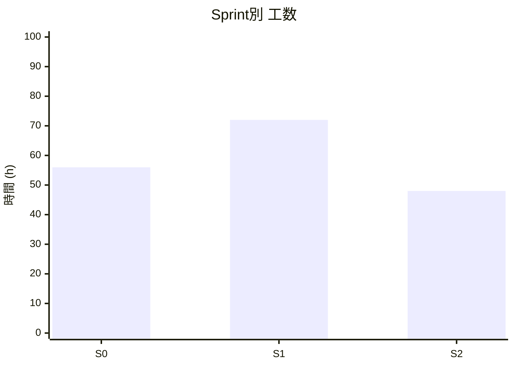
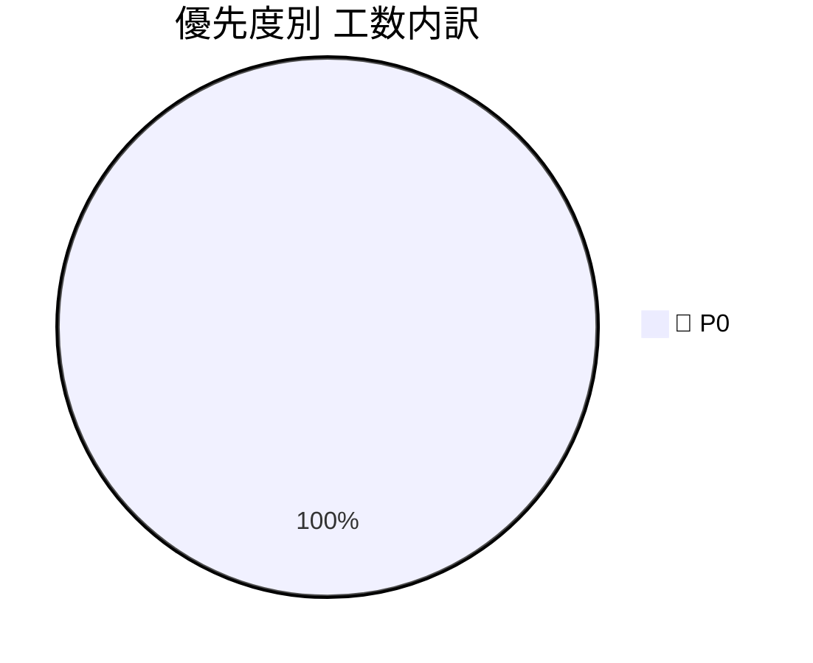
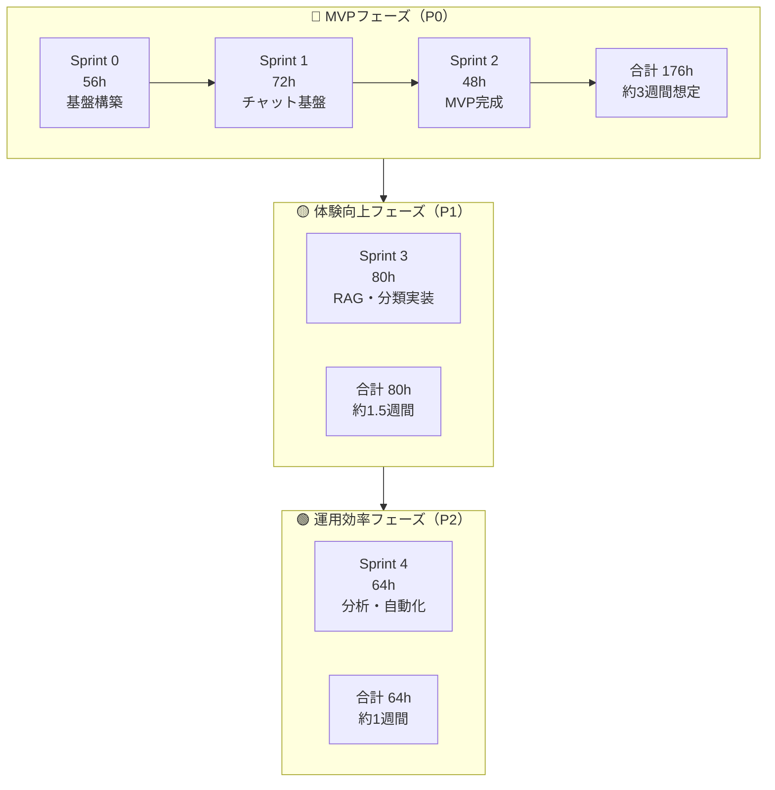

# 09_schedule_and_issues

作成日時: 2026年3月1日 17:28
最終更新日時: 2026年3月2日 13:58
最終更新者: iseebi

# 🚀 プロジェクトIssue管理テンプレート（工数見積もり付き）

---

## 📌 前提条件

- **1人日 = 8時間**
- 想定チーム規模：4名（FE / BE / Infra / Data）
- 見積単位：
    - XS = 2h
    - S = 4h
    - M = 8h
    - L = 16h
    - XL = 24h以上
- 優先度ラベル：
    - 🔴 P0：MVP必須
    - 🟡 P1：早期追加
    - 🟢 P2：中期対応
    - ⚪ P3：将来構想

## 3月 スケジュール

A:うおみー🐟
B:アリス🐜
C:伊勢海老🦐
D:黒子🥷

| 凡例 | 内容 |
| --- | --- |
| ○ | 作業可能(5時間) |
| △ | 作業可能(2～3時間) |
| × | 作業不可 |

| 日 | 月 | 火 | 水 | 木 | 金 | 土 |
| --- | --- | --- | --- | --- | --- | --- |
| **1**
A:○
B:△
C:○
D:〇 | **2**
A:△
B:△
C:×
D:〇 | **3**
A:×
B:△
C:○
D:× | **4**
A:○
B:△
C:△
D:× | **5**
A:△
B:△
C:△
D:△ | **6**
A:○
B:△
C:×
D:△ | **7**
A:×
B:△
C:○
D:△ |
| **8**
A:×
B:△
C:○
D:△ | **9**
A:×
B:△
C:△
D:△ | **10**
A:○
B:△
C:△
D:△ | **11**
A:△
B:△
C:△
D:△ | **12**
A:△
B:△
C:×
D:△ | **13**
A:×
B:△
C:×
D:△ | **14**
A:○
B:△
C:×
D:△ |
| **15**
A:×
B:△
C:×
D:× | **16**
A:×
B:△
C:×
D:× | **17**
A:×
B:△
C:×
D:× | **18**
A:×
B:△
C:×
D:× | **19**
A:×
B:△
C:△
D:× | **20**
A:×
B:△
C:△
D:〇 | **21**
A:×
B:△
C:○
D:〇 |
| **22**
A:×
B:△
C:○
D:〇 | **23**
A:△
B:△
C:△
D:〇 | **24**
A:△
B:△
C:△
D:〇 | **25**
A:○
B:△
C:△
D:〇 | **26**
A:△
B:△
C:△
D:〇 | **27**
A:○
B:△
C:○
D:〇 | **28**
 |
| **29** | **30** | **31** |  |  |  |  |

---

[シフト](%E3%82%B7%E3%83%95%E3%83%88%20316c40a7d2ef81a08cd4c0d30cc018ad.csv)

# 🏁 Sprint別 Issue一覧テンプレート

---

## 🏗️ Sprint 0：基盤構築（MVPの土台）

### 🔢 推定合計：74h

| # | タイトル | 工数 | 時間 | 優先度 | 担当 | 備考 |
| --- | --- | --- | --- | --- | --- | --- |
| #001 | TiDB環境構築 | M | 8h | 🔴 P0 | Infra | Docker or Cloud |
| #002 | DBスキーマ設計（logs / faq） | L | 16h | 🔴 P0 | BE | MVP最小構成 |
| #003 | Discordログ取得スクリプト | L | 16h | 🔴 P0 | Data | CSVでもOK |
| #004 | データクリーニング処理 | M | 8h | 🔴 P0 | Data | 正規表現 |
| #005 | BEプロジェクト初期構築 | M | 8h | 🔴 P0 | BE | FastAPI想定 |
| #046 | README 初期作成 | XS | 2h | 🔴 P0 | 全員 | プロジェクト概要・セットアップ手順・アーキテクチャ概要 |
| #047 | .gitignore / .env.example 整備 | XS | 1h | 🔴 P0 | Infra | 各サービス（Next.js / FastAPI / Dify）分を網羅 |
| #048 | PRテンプレート作成 | XS | 1h | 🔴 P0 | 全員 | `.github/pull_request_template.md` / 変更概要・テスト確認・スクリーンショット欄 |
| #049 | Issueテンプレート作成 | XS | 1h | 🔴 P0 | 全員 | Bug report / Feature request / Task の3種 |
| #050 | ブランチ保護ルール設定 | XS | 1h | 🔴 P0 | Infra | main への直push禁止・PR必須・CI通過必須 |
| #051 | CODEOWNERS 設定 | XS | 1h | 🔴 P0 | 全員 | フロント / バックエンド / インフラ 領域ごとにレビュー担当を明示 |
| #052 | Lint / Format 設定 | S | 3h | 🔴 P0 | FE/BE | FE: oxlint + oxfmt / BE: Ruff + Black |
| #053 | pre-commit hooks 設定 | XS | 2h | 🔴 P0 | 全員 | Lint・型チェック・秘匿情報（detect-secrets）の自動検査 |
| #054 | GitHub Actions 基本 CI | S | 4h | 🔴 P0 | Infra | lint / test / build を PR時に自動実行（FE・BE 各ワークフロー） |
| #055 | AI 設定ファイル整備 | XS | 2h | 🔴 P0 | 全員 | 下記「AI整備詳細」参照 |

## 🏗️ Sprint 1：チャット基盤（MVP中核）

### 🔢 推定合計：72h

| # | タイトル | 工数 | 時間 | 優先度 | 担当 | 備考 |
| --- | --- | --- | --- | --- | --- | --- |
| #010 | Chat API実装 | L | 16h | 🔴 P0 | BE | LLM接続 |
| #011 | FAQ検索ロジック | M | 8h | 🔴 P0 | BE | LIKE検索でOK |
| #012 | ログ保存API | M | 8h | 🔴 P0 | BE | token数保存 |
| #013 | フロントUI（チャット画面） | XL | 24h | 🔴 P0 | FE | 最小UI |
| #014 | BE/FE接続 | M | 8h | 🔴 P0 | FE/BE | 結合確認 |
| #015 | エラーハンドリング | S | 4h | 🔴 P0 | BE |  |

## 🏗️ Sprint 2：安定化＆可視化

### 🔢 推定合計：48h

| # | タイトル | 工数 | 時間 | 優先度 | 担当 | 備考 |
| --- | --- | --- | --- | --- | --- | --- |
| #020 | 利用ログ集計API | M | 8h | 🔴 P0 | BE | 日別集計 |
| #021 | 管理用簡易ダッシュボード | L | 16h | 🔴 P0 | FE | 質問数表示 |
| #022 | デプロイ設定 | L | 16h | 🔴 P0 | Infra | 本番反映 |
| #023 | 結合テスト | M | 8h | 🔴 P0 | 全員 |  |

## 🏗️ Sprint 3：今回スコープ外

### 🔢 推定合計：80h

| # | タイトル | 工数 | 時間 | 優先度 | 担当 |
| --- | --- | --- | --- | --- | --- |
| #030 | Embedding生成処理 | L | 16h | 🟡 P1 | Data |
| #031 | ベクトル検索実装 | L | 16h | 🟡 P1 | BE |
| #032 | RAG統合ロジック | L | 16h | 🟡 P1 | BE |
| #033 | 👍/👎機能 | M | 8h | 🟡 P1 | FE |
| #034 | カテゴリ自動分類 | L | 16h | 🟡 P1 | Data |
| #035 | 管理画面改善 | M | 8h | 🟡 P1 | FE |

## 🏗️ Sprint 4：今回スコープ外

### 🔢 推定合計：64h

| # | タイトル | 工数 | 時間 | 優先度 | 担当 |
| --- | --- | --- | --- | --- | --- |
| #040 | 定期データ更新（cron） | M | 8h | 🟢 P2 | Infra |
| #041 | トークン消費集計 | M | 8h | 🟢 P2 | BE |
| #042 | 質問カテゴリ集計 | M | 8h | 🟢 P2 | BE |
| #043 | 分析ダッシュボード拡張 | L | 16h | 🟢 P2 | FE |
| #044 | 異常検知アラート | M | 8h | 🟢 P2 | BE |
| #045 | FAQ自動改善候補抽出 | L | 16h | 🟢 P2 | Data |

---

# 📊 工数サマリー

## Sprint別工数



---

## 優先度別内訳



---

# 🗓️ フェーズ分解テンプレート



---

# ⏱️ クリティカルパス可視化テンプレート

```mermaid
gantt
    title MVP クリティカルパス
    dateFormat X
    axisFormat %s h

    section 基盤
    DB設計        :crit, 0, 16
    Discord取得    :crit, 0, 16

    section コア
    Chat API       :crit, 16, 16
    UI開発         :crit, 16, 24

    section 結合
    デプロイ       :crit, 40, 16
```



---

# 📈 規模感サマリー表

| 区分 | Issue数 | 工数合計 | 並行4名想定 |
| --- | --- | --- | --- |
| 🔴 MVP | 15件 | 176h | 2週間 |
| 🟡 P1 | (今回スコープ外) |  |  |
| 🟢 P2 | (今回スコープ外) |  |  |
| **合計** | 15件 | 176h | 2週間 |

---

# 🧮 見積もり計算

```
合計実働時間 = (55 + 67.5 + 62.5 + 82.5) ×0.8 = 218h
```

```
176h ÷ (4人 × 20h/週) = 約2週間
```

※ レビュー・テスト込みなら ×1.3〜1.5 を推奨

---

# 🎯 実務で使う際の運用ルール（推奨）

### 1. 見積もり精度向上

- UIはデザイン確定後に再見積
- AI/外部API依存はバッファ20〜30%確保
- 初心者アサイン時は+30%補正

### 2. スプリント設計

- MVPは **P0のみ抽出**
- FE最大工数タスクは早期分解
- API設計 → UI → 結合の順に並べる

### 3. 並行開発最適化

- BE専任1〜2名を確保
- FEはUI集中Sprintを分離
- Infraは最初に完了させる

---

# 🔎 使い方まとめ

1. 全Issueを書き出す
2. 工数ラベルを割り当てる
3. P0のみ抽出 → MVP期間算出
4. 1.3倍補正をかけて現実的スケジュール化
5. クリティカルパスをMermaidで可視化